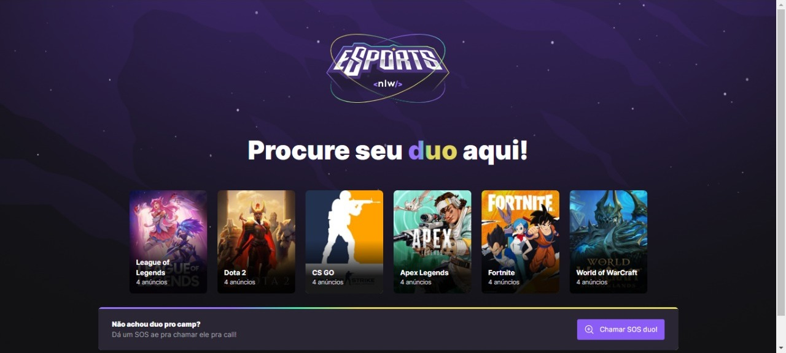
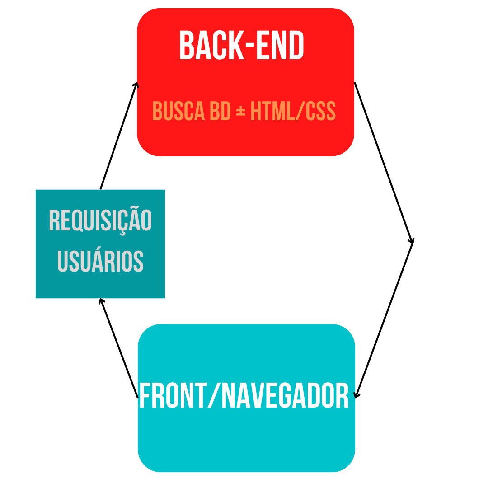
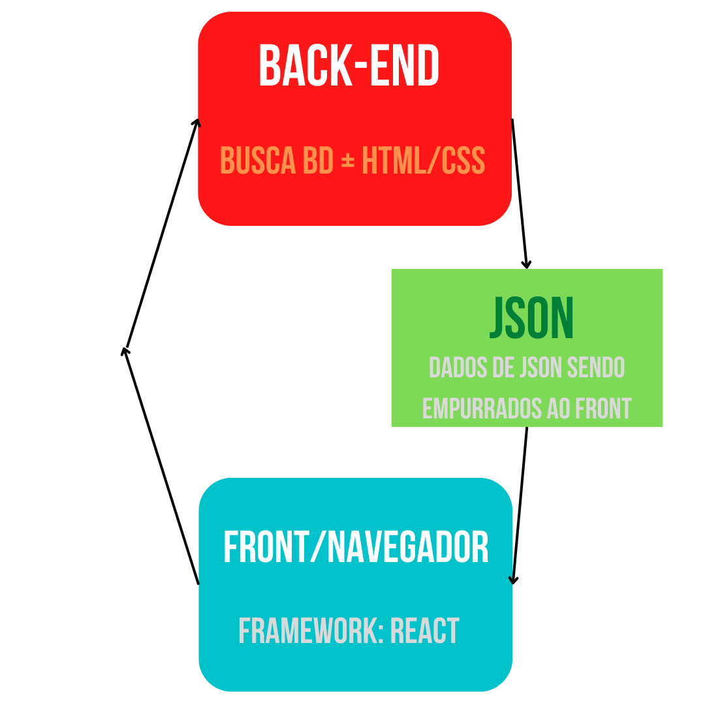

# NLW Esports

**Este projeto de uma rede social, guiada pela Rocktseat desenvolvido com Node.js, React, React Native. Bora codar** 🚀!


--- 
## [Figma](https://www.figma.com/community/file/1150897317533332617)

---


## Diferença de Aplicação SPA, para uma página web:

### Abordagem de interpretação do navegador:

**Em uma página comum que conhecemos, seu estilo de HTML, CSS e JS puros, o esquema que acontece é que desenvolvemos as linhas de código linha a linha, para ser interpretado pelo navegador, que busca de um back-end padrão mensagens de um banco de dados e faz a função de carregar essas linhas de código na página, ou seja, a maior parte do serviço fica por baixo dos panos, sem muito controle do desenvolvedor. Muitas vezes não conseguimos atribuir isso que tudo não consegue ser controlado, dificultando a aplicação seja flexível a diversos públicos por exemplo.**

**Este esquema:**



### Aplicação SPA:

**Já em uma aplicação de SPA, (*singles page application*), busca o trabalho mais do lado do cliente, em que ele consegue carregar em sua página, somentre o que precisa, assim tendo total controle, sendo mais flexível, e mais leve ao usuário e ao navegador!**

**Ainda, quando tratamos de uma SPA, tratamos de JS e seus frameworks, muitos em Typescript, porém mesmo atribuindo a mais alguma linguagem, isso leva a carregar melhor as aplicações, somente com oque é preciso a ser carregado dentro da página, e ainda conseguido ser traduzido a vários tipos de áreas, como sendo uma aplicação, ela pode ser flexível a mobile, desktop, ou mesmo ao lado do servidor, não precisando a tradução da parte do desenvolvedor, mas deixando aos frameworks JS.** 

**Ela carrega diretamente a página do front, e assim busca somente os dados do back-end, e assim, já que o back só fica encarregado dos dados, ele só devolve dados, outra vantagem, que ele devolvendo somente estes dados, eles são em JSON, um tipo de estrutura de dados de JS para objetos!**

**Este esquema:**



---

## Building `./server`:

**Antes de começar a desenvolver, como estamos fazendo uma aplicação, precisamos configurar o ambiente base, assim fazendo o building do projeto. Nesta página:**

[Building SPA Back-End](https://www.notion.so/Building-SPA-Back-End-17fa16f5a68f4d9189de9a6bfe2a2a17)

---

## Criando app React de `./web` 

**Agora que já configuramos o ambiente de back-end em node, podemos criar nosso ambiente de app em React, vamos começar usando uma ferramenta, o [Vite.js](https://vitejs.dev/), que é uma ferramenta que usa as bibliotecas das mais atualizadas do JS, e ainda consegue ser mais performático que instalar padronizado no próprio React!**

### Comando criação do app

```jsx
npm create vite@latest
```

<aside>

💡 **As configurações do projeto são de cada projeto e este foram usadas em Web e React**

</aside>

---

## Criando app de `./mobile` 

**Agora que conseguimos fazer o app para web, ou desktop como chamar, iremos criar a configuração de building para mobile, pois queremos que ele esteja disponível em React Native para mobile! Para isso usaremos outra ferramenta que se adapta bem a mobile, que é a [Expo](https://expo.dev/)**

### Comando criação do app:

```jsx
expo init mobile
```

<aside>

💡 **As configurações do projeto são de cada projeto e este foram usadas em blank(Typescript)**

</aside>

**Logo depois só carregar no emulador ou dispositivo seguindo as instruções no terminal!**

---